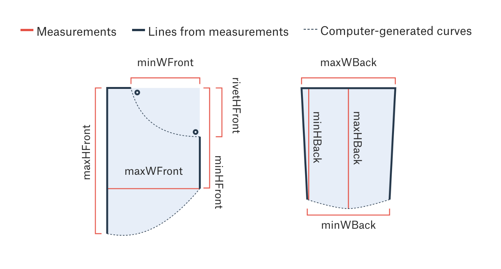

This folder contains all of the data used in The Pudding article [Women's Pockets are Inferior](https://pudding.cool/2018/08/pockets/) published in August 2018.

Below you'll find metadata for each file.

## measurements.csv

- 	**What is this?**: This file contains all of the measurements for 80 pairs of blue jeans from the most popular and widely available brands in the US.
-   **Source(s)**: All data was collected from manual measurements by Jan Diehm and Amber Thomas at brick and mortar stores in Nashville, New York, and Seattle. All measurements of front pockets were taken of the right-hand-side front pocket of empty jeans.
-   **Last Modified**: August 13, 2018
-   **Contact Information**: [Amber Thomas](mailto:amber@polygraph.cool)
-   **Spatial Applicability**: United States
-   **Temporal Applicability**: All measurements were collected between June 29 and August 6, 2018
-   **Observations (Rows)**: Each row represents data from a single pair of jeans.
-   **Variables (Columns)**:

| Header | Description | Data Type |
|---|---|---|
| `brand` | The full brand name. | text |
| `style` | The cut of each pair of jeans (in our analysis, we combined straight and boot-cut styles and skinny and slim styles, but these remain separated here). | text |
| `menWomen` | Whether the jeans were listed as "men's" or "women's". | text |
| `name` | The name of the specific style of measured pair of jeans as indicated by the tag. (e.g., `Fave Super Skinny Jean`). | text |
| `brandSize` | The size of jeans we measured. Each size listed here reflects the sizing for each brand that is closest to a 32 inch waistband (as indicated by the brand's website). | text |
| `waistSize` | The waistband size (in inches) of each measured pair as reported on the brand's website. | number |
| fabric | The comma-separated fabric combination as indicated by the tag on the jeans. (e.g., `78% cotton, 20% polyester, 2% spandex`). | text |
| price | The price (in US dollars) of each pair of jeans. This number is listed without the dollar sign ($) or any extra 0's (so $39.50 would be written as `39.5`) | number |
| maxHeightFront |  The height (in cm) of the front pocket from the top of the highest rivet to the lowest point of the pocket (along the left-hand side or zipper side). *See diagram below.*| number |
| minHeightFront | The height (in cm) of the  front pocket from the top of the highest rivet to the lowest point of the pocket (along the right-hand side or non-zipper side). *See diagram below.*| number |
| rivetHeightFront | The distance (in cm) between the top of the highest rivet to the lowest rivet. | number|
|maxWidthFront| The width (in cm) from the widest point of the front pocket. *See diagram below.*| number |
|minWidthFront| The width (in cm) from the highest rivet to the right or non-zipper side of the pocket. |number|
|maxHeightBack|The height (in cm) from the deepest point of the back pocket (usually in the pocket's center) to the top of the pocket. *See diagram below.*| number |
|minHeightBack| The height (in cm) from the shallowest point of the back pocket to the top of the pocket. | number|
|maxWidthBack| The width of the pocket at the very top (the opening) *See diagram below.*| number |
|minWidthBack| The width of the pocket at its narrowest (just before the pocket tapers to a point). *See diagram below.*| number |

- **Diagram of Measurements**:

- **Other Notes**:

  - For each brand mentioned in this study, 4 pairs of jeans were measured: a skinny and straight style in both men’s and women’s clothing. “Skinny” style is referred to as “slim” in some brands and if a standard “straight” style was unavailable, a “boot-cut” style was used instead. Although we did come across some pockets that were completely sewn shut, we were able to find another version of that same style from that brand that did include a true pocket. Wherever possible, we used “standard” or “mid-rise” jeans, though on occasion, none were available and either high- or low-rise jeans were used as a substitute. All jeans measured had a 32 inch waistband as designated by the sizing guides on each brand’s website. Although this is smaller than the median waist size for women in the US, it was determined to be a size that was regularly available in both men’s and women’s cuts.

  - To measure the pockets, jeans were unbuttoned and unzipped (and occasionally flipped completely inside-out). Pockets were measured from the inside of the jeans. While the overall height and width of the pockets was measured, the curvature of the pocket displayed in this article was computer generated.

## measurementRectangles.json
- 	**What is this?**: This file contains all of the same measurements as `measurements.csv` but also includes the sizes of the largest rectangles that could theoretically fit in each front pocket.
-   **Source(s)**: All data was collected from manual measurements by Jan Diehm and Amber Thomas at brick and mortar stores in Nashville, New York, and Seattle. All measurements of front pockets were taken of the right-hand-side front pocket of empty jeans. The largest rectangles were calculated using the [largestRect()](https://d3plus.org/docs/#largestRect) function from the [d3plus](https://d3plus.org/docs/#largestRect) library. The full code used to generate this calculation can be found [here](https://github.com/the-pudding/pockets/blob/master/src/js/pudding-chart/rect-calc-template.js).
-   **Last Modified**: August 13, 2018
-   **Contact Information**: [Amber Thomas](mailto:amber@polygraph.cool)
-   **Spatial Applicability**: United States
-   **Temporal Applicability**: All measurements were collected between June 29 and August 6, 2018
-   **Observations (Rows)**: Each row represents data from a single pair of jeans.
-   **Variables (Columns)**: This file contains all of the same measurements listed in `measurements.csv` with the following additions:

| Header | Description | Data Type |
|---|---|---|
| `updatedStyle` | The binary style for each pair of jeans  &bull; `skinny` = skinny or slim style &bull;`straight` = straight or boot-cut | text |
| `group` | The combination of either men or women and skinny or straight (e.g. `women - skinny`) | text |
| `priceGroup` | Which of four price groups does this pair of jeans fall into? The options are `<$50`, `$50 - $99`, `$100 - $149`, `$150+` | text |
| `pocketArea` | The area of the polygon generated from a pocket's measurements. This was calculated using the `d3.polygonArea()` function in d3.v4 | number|
| `rectanglePhone` | The largest rectangle that could fit inside of the pocket-shaped polygons with a 0.5 width : height ratio. *There are values nested here, see more info on rectangle measurements below.* | nested values|
| `rectanglePen` | The largest rectangle that could fit inside of the pocket-shaped polygons with a 0.1 width : height ratio. *There are values nested here, see more info on rectangle measurements below.* | nested values|
| `rectangleWallet` | The largest rectangle that could fit inside of the pocket-shaped polygons with a 0.8 width : height ratio. *There are values nested here, see more info on rectangle measurements below.* | nested values|
| `rectangleHand` | The largest rectangle that could fit inside of the pocket-shaped polygons with a 0.57 width : height ratio. *There are values nested here, see more info on rectangle measurements below.* | nested values|

The nested values listed above were all generated from the [largestRect()](https://d3plus.org/docs/#largestRect) function from the [d3plus](https://d3plus.org/docs/#largestRect) library. The nested values are as follows:

| Header | Description | Data Type |
|---|---|---|
| `angle` | The angle that the rectangle would be oriented in (according to the d3plus [documentation](https://d3plus.org/docs/#largestRect), an angle of 0 means that the "longer side of the polygon - the width - will be aligned with the x axis"). | number |
| `area` | The area of the largest rectangle generated. | number |
| `cx` | The x coordinate of the center of the largest rectangle generated. | number |
| `cy` | The y coordinate of the center of the largest rectangle generated. | number |
| `height` | The height (in pixels) of the largest rectangle generated.| number |
| `heightCM` | The height (in cm) of the largest rectangle generated. | number|
| `width` | The width (in pixels) of the largest rectangle generated. | number |
| `widthCM` | The width (in cm) of the largest rectangle generated. | number |
| `points` | An array of 5 x, y coordinates, denoting where the corners of the largest rectangle would be drawn (assuming it were on a canvas that is 225px wide by 175px tall). | nested values |
