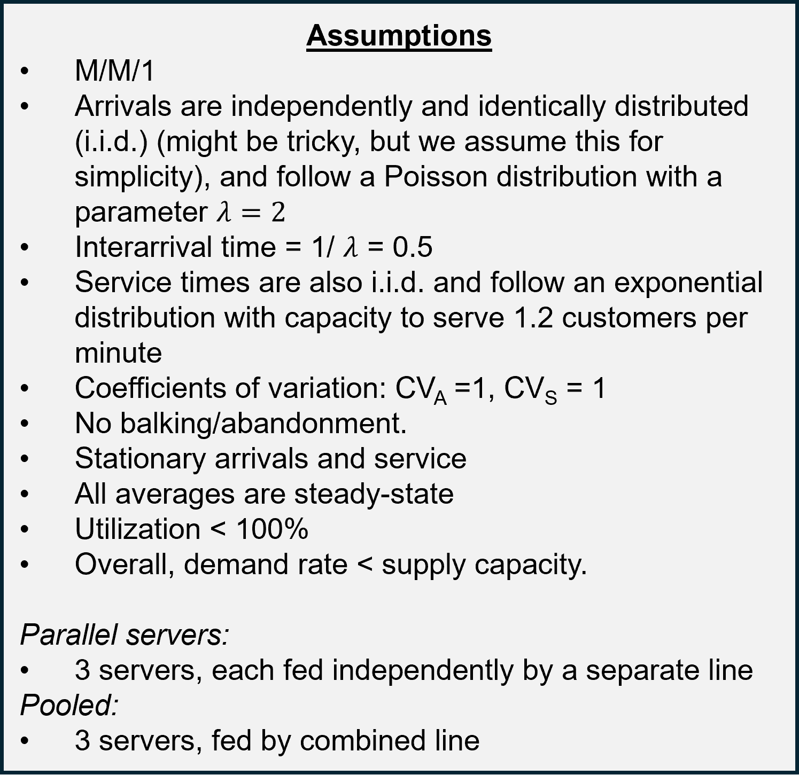
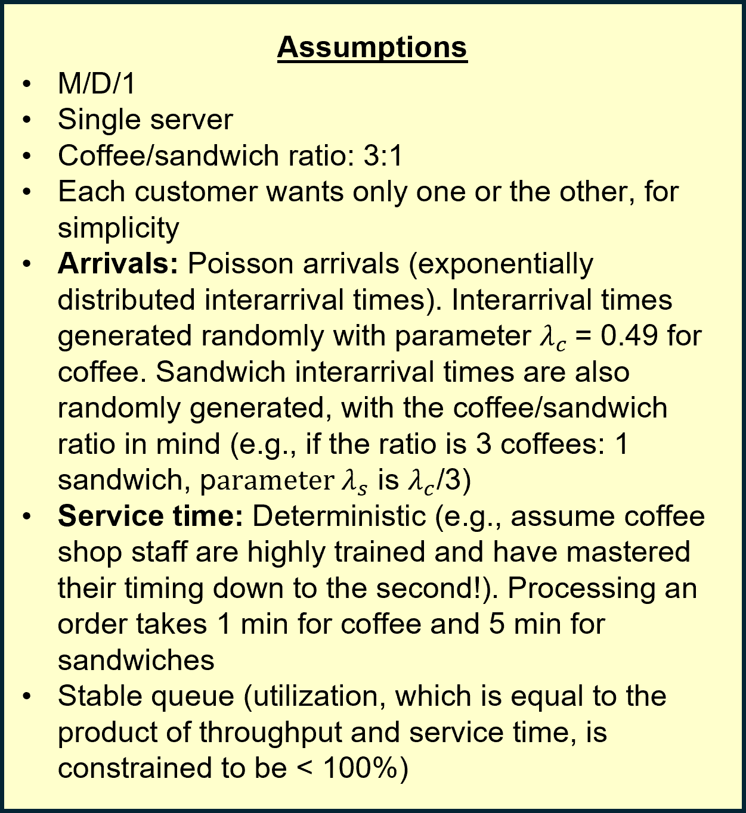
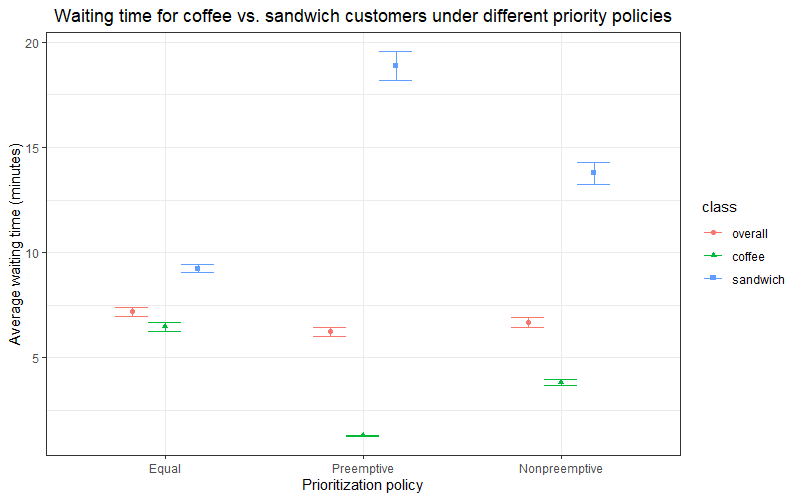
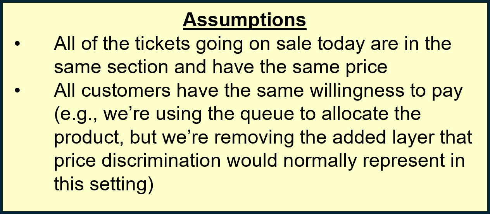
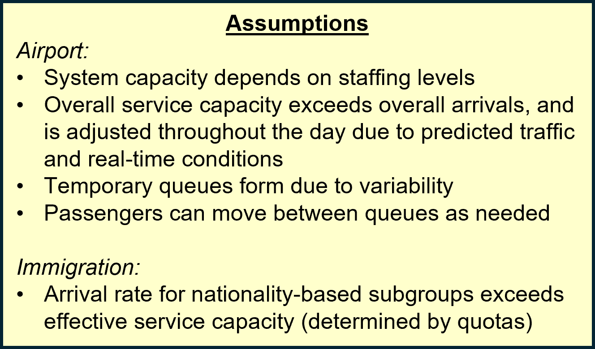

# The story behind "Tired of waiting in line?"
Queues are guaranteed to form when the demand rate exceeds the supply capacity, or the number of customers who can be served per unit of time. However, even when average capacity exceeds the average demand rate, queues can still form when there’s sufficient variability in either arrival times or the time required for service.

This video highlights a few different situations where queues might arise, all in the familiar context of an airport.

See a summary of core takeaways below, and scroll further down for additional details.

| **Scene**      | **Description** | **Setting** | **Core takeaway**     |
| :---  |    :----:   | :----:   |         :--- |
| 1      | Pooled vs. parallel        | Ticket counter        | Pooled queues (where a single line leads to multiple agents) can be much faster than parallel queues (where each line leads to one agent) because they create economies of scale and allow for flexible reallocation of capacity in response to variability (e.g., if one customer takes an unusually long time to serve). Pooling can achieve lower wait times for a given capacity level or lower capacity utilization for a given service level.   |
| 2   | Priority queues and fairness        | Café      | Moving “quick” customers to the front of the queue ahead of “slow” customers can significantly decrease average wait times, but it comes at the cost of longer waits for the “slow” customers. More generally, queue designers have to trade off different considerations, including optimal system performance versus fairness.     |
| 3   | Alternative queueing disciplines       | Concert tickets  | When a good has limited supply and service — specifically, the service of allowing customers to purchase the good — is provided on a first-come-first-serve (aka first-in-first-out, or FIFO) basis, customers can end up joining the queue earlier and earlier in order to secure an opportunity for service. Think pre-announced drops of the latest iPhone or shoe model, sports tickets, concert tickets, etc. This can spiral out of control until the entire benefit gained from the good is eaten up by the cost of queuing. As such, people who value the product the most may be disadvantaged in a FIFO system with limited supply. Queue designers can use solutions such as lotteries to mitigate this issue.    |
| 4   | Boundless queues        | Short- and long-term immigration      | If system capacity (represented by the processing time, or service rate) exceeds the rate of new arrivals, queues may either a) never arise (if there is no variability) or b) arise temporarily due to variability in arrivals or processing, but eventually be resolved. However, if the service rate is _slower_ than the arrival rate, queue length and wait time can increase indefinitely.      |

# Scene \# 1: Pooled vs. parallel (Ticket counter)
***

In the first scene, we explore the concept of pooling. Pre-assigning customers to a server can lead to a situation where passengers in one queue are waiting despite some of the other servers being available. Pooling allows the system to eliminate such inefficient imbalances* by flexibly redeploying capacity.

For our first example, we assume that customers arrive every 45 seconds, and that it takes 90 seconds to serve each one. We calculated how long it would take an average newly-arriving customer to get through each line using the following formulas [1]: 

Average wait time for customers in the single server setup:

$$W_{parallel} = s \left( \frac{U}{1-U} \right) \left(\frac{(CV_a + CV_s)^2}{2} \right)$$

Average wait time for customers in the multiple-server setup:

$$W_{pooled} = \frac{s}{m} \left( \frac{U^{\sqrt{2(m+1)}-1}}{1-U} \right) \left(\frac{(CV_a + CV_s)^2}{2} \right)$$

where $$s$$ is the processing time for a single server, $$m$$ is the number of servers, $$U$$ is utilization, and $$CV_a$$ and $$CV_s$$ represent the coefficient of variation** for arrival time and service time, respectively.

Comparing these two wait times allowed us to calculate the reduction in waiting time that was achieved through pooling. The reduction for this simple example with zero variation was 76.2\%.

To create a basic simulation, we slightly perturbed the interarrival time (using a normal distribution centered at 45 seconds and with a standard deviation of 1), as well as the service time ($$\mu = 90, \sigma = 1$$). In reality, there would likely be greater variation in arrival times - we'll explore this in a moment. Variability in service times may depend on how standardized processes are; for simplicity, we limit their variability for now.

Varying arrival time and service time has the effect of also varying the utilization between 61.5\% and 73.1\%. Importantly, utilization is always below 100\%, which means that we have a stable queue. Over these 1,000 reps, we then calculated the resulting waiting times for the parallel and pooled scenarios using the same formulas as above.

The result was an average pooling reduction of 76.2\%, with all 1,000 reps achieving a reduction of at least 74%.

Next, we increase the variability of interarrival times to SD = 4 seconds in order to more accurately represent periods of the day/week that are slightly more or less busy. This means that the time between passenger arrivals is still centered at 45 seconds, but now ranges between 34 seconds and 58 second across the 1,000 reps. With service times still distributed tightly around 90 seconds, this causes server utilization to vary between 52 and 88\%). Even with this increased variability, pooling would still result in a reduction of 70\% or more for all 1,000 reps.

In general, wait time depends on system capacity, server utilization, and variability in arrival or processing times. It's worth noting that wait times - and also, the difference in wait times between a parallel and pooled setup - are [sensitive](https://nickarnosti.com/blog/longwaits) to server utilization level (i.e., how busy a server is), which is why planners often opt to build in slack in server availability. The number of servers changes how high this sensitivity is [2].

*Note: this may backfire in settings such as healthcare, where the relationship between customer and server (or the server’s sense of [“customer ownership”](https://knowledge.insead.edu/operations/when-several-queues-are-better-one)) can impact processing time, or in settings where customers are [delay-sensitive](https://pubsonline.informs.org/doi/10.1287/mnsc.2020.3663) and decide whether or not to join based on queue length.

**This is a normalized measure of variability that's used commonly in the context of queueing. It's defined as the ratio of the standard deviation to the mean.

# Scene \# 2: Priority queues and fairness (Café)
***

In our second example, we consider a situation where we have more than one type of customer. These are formally known as “multiclass” models, where customer groups may differ in terms of arrival rates and service rates (and possibly other characteristics).

In this setting*, waiting time for a newly-arriving customer includes the following components: 
- Remaining service time for those already in service when you arrive
- Service time for those still waiting for service when you arrive
- Service time for those who arrive after you, but must be served first (this is zero unless you’re using a preemptive priority policy)
- Your own service time

We consider three possible priority policies [3]:
- Equal priority (all customers served in order of arrival)
- Preemptive priority (Newly-arriving coffee drinkers interrupt sandwich service)
- Non-preemptive priority (Newly-arriving coffee drinkers skip to front of queue, but don’t interrupt sandwich service that's already begun)

The focal customer's expected wait time (upon arrival) is determined by the number and ordering of customers of each class who are already waiting. We set the ratio of coffee to sandwich arrivals exogenously, but the exact order of arrival is subject to randomness.

In a general M/M/1 setup (i.e, exponentially distributed interarrival and service times), you can think of the wait time under each policy for an average arriving customer in each class as follows [4]. Note that each term in the equations below corresponds to one of the components described above. Can you identify which is which?

<ins>__Equal Priority__</ins> \
Coffee: $$W_c = Q_c s_c + Q_s s_s + s_c$$ \
Sandwich: $$W_s = Q_s s_s + Q_c s_c + s_s$$ 

<ins>__Non-preemptive priority for coffee-drinkers__</ins> \
Coffee: $$W_c = Q_c S_c + U_s s_s + s_c$$ \
Sandwich: $$W_s = Q_s S_s + Q_c s_c + \lambda_c (W_s - s_s) s_c + s_s$$

<ins>__Preemptive priority for coffee-drinkers__</ins> \
Coffee: $$W_c = Q_c S_c + s_c$$ \
Sandwich:  $$W_s = Q_s S_s + Q_c s_c + \lambda_c W_s s_c + s_s$$

where:

$$W_c =$$ total waiting time for coffee customer

$$W_s =$$ total waiting time for sandwich customer

$$𝑄_c =$$ avg \# coffee customers in queue

$$𝑠_𝑐 =$$ service time for coffee customers

$$𝑄_𝑠 =$$ avg \# sandwich customers in queue

$$𝑠_𝑠 =$$ service time for sandwich customers

To study our multiclass system empirically, we generated a sequence of coffee and sandwich customers arriving according to the parameters stated above. For our first example, we generated 21 arrivals (16 coffee/5 sandwich) during a 30-minute window. Note that in this case, we treat service times as deterministic, rather than random (i.e., our system is M/D/1, rather than M/M/1).

We then explicitly calculated the exact wait time (from arrival to service completion) for each arriving customer under each of the three priority policies.

We repeated this 1,000 times, generating a slightly different number of arrivals each time (but using the same average ratio of 3 coffee: 1 sandwich).

The figure below demonstrates the distribution of wait times under each policy. As you may have expected, the non-preemptive priority policy provides a compromise between a fully preemptive policy and treating all customers equally (though sandwich customers may not see it that way!).

 

We mention in the video the idea of providing "some, but not infinite" priority: To implement this, the shop owners might decide to optimize for minimizing the average wait time while ensuring that the maximum wait time stays below a certain limit. Practically speaking, this could mean that if there are coffee-orderers waiting, the barista can take a break from making sandwiches, but only up to a maximum number of coffee orders.

If the average wait time for sandwich orders increases enough, the sandwich-orderers might get tired or reach the point where they’d have to leave to catch their flight, and therefore abandon the queue. Finding compromise solutions is therefore important.

*We're using a variation of the "tagged customer method", which helps us think about estimated wait time in terms of the situation that an arbitrary customer might face upon arrival. Thank you to Daniel Myers for this suggestion!

More on: 

- Express lanes at supermarkets ( [link](https://operationsroom.wordpress.com/2014/10/17/how-should-a-supermarket-organize-its-checkout-lanes/) )

# Scene \# 3: Alternative queueing disciplines (Beyoncé tickets)
***

In this scenario, you're queueing for a scarce good (concert tickets). There are many ways to allocate scarce goods: ticket prices often vary widely even within a single section, and are used to differentially target customers with different levels of  willingness to pay. That said, even for tickets at the same price, there is limited supply, and not everyone who wants one will get one - especially for sought-after artists. In other words, service is not guaranteed even if you complete the wait.

You place a certain amount of value on seeing Beyoncé (e.g., $1,000). Because there is a chance of not securing a ticket, some people may calculate an “expected value” which incorporates their beliefs about the likelihood of securing a ticket. In this case, each person’s value is private (and perhaps not even consciously known to the individuals themselves). In other cases, value is known to each individual, and can be elicited using auctions or other methods.

You also incur a certain cost while waiting. Most people aren’t explicitly tallying these costs, but you can imagine that each person has a subconscious “willingness to wait”, perhaps captured by the length of time beyond which even the guarantee of a ticket would no longer be worth enduring the wait. This is connected to the fact that each person has an opportunity cost of waiting – for example, perhaps the amount they might have earned at work that day if they hadn’t taken time off to wait. If we could determine this figure for each person, we could calculate the point at which we’d expect them to abandon the queue. 

A typical default queue policy is first in, first out (FIFO) – but this can cause issues for highly competitive goods. Because of a mismatch between the cost of waiting and value placed on the good, FIFO may fail to allocate a good or service to those who value it most, and may instead advantage those who have a lower cost of waiting.

FIFO policies have other issues: they may also incentivize scalpers to hoard tickets and sell them at a premium. Allowing fans to pay for priority access to the queue is one option that has been used in many settings, but imposing additional financial burden for a good that is already so costly may be undesirable. Other alternatives, such as releasing tickets in stages, offering scheduled viewing or buying windows, or even unusual policies such as [serving the last person to arrive first](https://www.sciencenordic.com/culture-denmark-environment/queues-move-faster-if-the-last-person-is-served-first/1420582), may incentivize users to change their behavior in a way that reduces average waiting time. Queue designers have a lot to consider when allocating complex resources like this.

How might we measure or compare how well two different queueing disciplines perform in this system? Standard metrics such as waiting time or average queue length may not capture the full picture. Other things that could be useful to measure include the following:
- Percentage of customers who waited but did not get a ticket (even better if we can show the distribution of how long customers waited before going home empty-handed)
- Waiting cost incurred per customer (even better if we can compare to value placed on ticket)
- Percentage of customers who had to abandon the queue
- Comparison of the distribution of ticket holders to the distribution of "fan dedication". In other words, can we quantify how effective a particular mechanism was at allocating this product to those who valued or needed it most?
- Can you think of any others?

More on:

- Lotteries ( [link](https://operationsroom.wordpress.com/2012/12/11/apple-replaces-queues-with-a-lottery/) )

# Scene \# 4: Boundless queues (Immigration)
***

In the final scene, we explore the idea that a queue can, for all practical purposes, become infinitely long under the right (well, wrong) circumstances.

Two queue properties (which we also referenced briefly earlier in the video) are relevant here: the service rate refers to how quickly each person gets through the line (in other words, it's connected to the system’s capacity), and the arrival rate is how quickly new people are arriving - this represents demand.

Queues at the airport fluctuate in length over the course of the day, and disappear completely when the balance between capacity and demand rate becomes more favorable - for example, due to a slowdown in flight arrivals or the addition of more immigration officers. Airports can take proactive measures to prevent these queues from getting too long by controlling arrival rate, service rate, or both. For example, an airport may limit the number of international flights that can arrive in a given hour, and tools such as pre-approval programs (e.g., Global Entry) can help reduce the time required to serve some customers.

Just as service capacity can be increased through staffing levels, it can be decreased for some or all customers. For example, when different numbers of staff are assigned to serve customers from particular groups, those groups experience different service rates. At the airport, one example could be queues for foreign versus domestic passengers. Policies such as quotas may also limit service rates directly or indirectly. In the long-term immigration context shared in the video, quotas are often nationality - based.

Once the wait time becomes effectively infinite, customers have no choice but to opt out of service. A system's consistent inability to process customers faster than they arrive is therefore a serious problem.

More on:

- Green card allocation by nationality ([link](https://www.uscis.gov/green-card/green-card-processes-and-procedures/visa-availability-and-priority-dates))
- Sample visa bulletin (with priority dates) for October 2024 ([link](https://travel.state.gov/content/travel/en/legal/visa-law0/visa-bulletin/2025/visa-bulletin-for-october-2024.html))
- Wait time for Indian green card candidates (September 2023, Boundless Immigration) ([link](https://www.boundless.com/blog/indians-face-134-year-wait-employment-based-green-card/))
- Airport border delays at major US airports (May 2012, WSJ) ([link](https://www.wsj.com/articles/SB10001424052702304743704577382250767742434))

## References
***
[1] Gerard Cachon and Christian Terwiesch. 2018. Matching Supply with Demand: An Introduction to Operations Management (4th ed.). McGraw-Hill.

[2] Gerard Cachon and Christian Terwiesch. 2022. Operations Management (3rd ed.). McGraw-Hill.

[3] Richard Larson and Amedeo Odoni. 1981. Urban Operations Research. Prentice-Hall.

[4] Lecture notes and course materials on queueing theory and simulation/stochastic modeling by Daniel S. Myers

### Acknowledgements
***
Many thanks to Professor Daniel S. Myers, Dr. Shraddha Rana, Dr. Angela Acocella, and Professor Abhishek Deshmane for their feedback and suggestions during the development of this story.